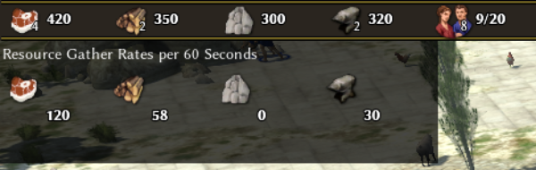

# 0ad Economy Helper
Mod for the game [0ad](https://play0ad.com/) that should help with managing the economy.

## Description
So far, only one feature has been implemented: A counter that keeps track of your resource gather rates in a certain time window.

* Toggle the overlay with Ctrl+E
* Configure the length of the time window under `economyhelper.resourcegatherrates.window.seconds`
  * Defaults to 60 Seconds

## Compatibility
Written for 0ad version 0.0.24. Compatibility with older verions has not been tested.

